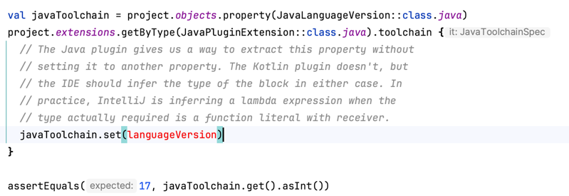

# Inferred type issues

This branch contains an example of an issue I've found in IntelliJ IDEA.

While the code compiles and runs via Gradle:

```shell
./gradlew check
```

If you import it into IDEA then you'll get an error reported in
[CanReadLanguageVersion](./src/test/kotlin/eu/aylett/gradle/plugins/conventions/CanReadLanguageVersion.kt):



Putting the same source in a `main` source set appears to work.

This is obviously a very-much reduced example!
